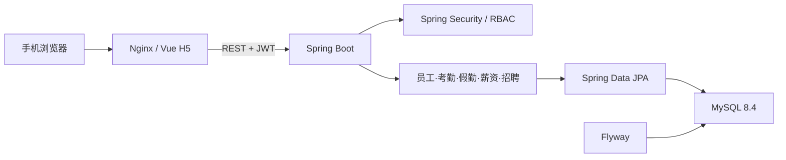

# ZhuaTech EHR 架构说明

Copyright © 2026 上海如静知华信息科技有限公司。

## 设计目标

社区源码版采用“前后端分离 + 模块化单体”架构，在降低个人学习环境部署成本的同时保持员工、假勤、薪资与招聘边界清楚。

## 后端分层

- `controller`：REST 接口、参数校验与角色权限入口。
- `service`：当前员工等可复用业务服务。
- `model`：JPA 聚合与员工、审批、薪资、招聘状态变化。
- `repository`：数据访问接口。
- `security` / `config`：JWT、Spring Security、CORS 与演示数据。
- `common`：统一响应、业务异常及全局错误处理。

所有 Java 代码使用 `cn.zhuatech.ehr` 根包。数据库结构由 Flyway 迁移管理，发布后禁止修改历史迁移，应通过新版本脚本演进。

## 权限与隐私边界

- `EMPLOYEE`：本人考勤、请假和薪资；可查看基础员工花名册。
- `HR`：员工档案、请假审批、薪资与招聘管理。
- `ADMIN`：拥有社区源码版全部管理权限。

密码使用 BCrypt，API 使用 JWT。薪资、身份证明、联系方式等属于敏感人事数据，真实部署还需补充字段级权限、数据脱敏、操作审计、加密存储、备份恢复和数据保留策略。

## 扩展建议

后续可按 `lifecycle`、`schedule`、`performance`、`training` 等领域模块扩展。在团队规模、发布节奏或负载形成明确边界后，再考虑事件驱动与服务拆分。

架构咨询与深度定制：[知华科技](https://www.zhuatech.cn/)（上海如静知华信息科技有限公司）。
